# AI-PMO Platform

[](https://github.com/itanaka66/AI-PMO-Platform/actions/workflows/tests.yml)

はじめての方は [はじめてのガイド（8言語）](docs/guide/README.md) をどうぞ。
New here? Start with the [getting-started guide (8 languages)](docs/guide/README.md) .

<a href="https://claude.ai/code/artifact/877371e4-7535-46c8-91bb-027d61dbc1a6" target="_blank">初心者向けAI-PMO
はじめてのガイド</a>  PMO 業務のノウハウを「実行可能なテンプレート」として記述し、LLM と外部ツール連携を
組み合わせて自動実行する基盤。 

<a href="https://claude.ai/code/artifact/877371e4-7535-46c8-91bb-027d61dbc1a6" target="_blank">AI-PMO Getting Started Guide for beginers</a>  A runtime that encodes PMO know-how as executable templates and runs them by
combining LLM calls with the tools a team already uses.

**すべて無料です。** 機能制限版でも試用版でもありません。MIT License なので、
商用利用も改変も再配布も自由です。

**All of it is free** — not a reduced edition, not a trial. MIT licensed, so
commercial use, modification and redistribution are all permitted.

---

## アーキテクチャ（構想） / Architecture (vision)

PMO 業務全体を、経営者/PM の承認を挟みながら自律的に回すループとしての全体像。
図の各要素と、実際に動いているコードとの対応は図の下の表を参照。

The overall loop this project is working toward — an autonomous PMO cycle
with the executive/PM's approval as its gate. See the table under the
diagram for how each box maps to code that actually exists today.

```mermaid
flowchart TB
    exec["👤 経営者 / PM<br/>戦略・目標の設定、承認・判断"]
    core["🧠 PMO AI Core<br/><b>自律型PMOエンジン</b><br/>全体最適化・意思決定・ルール管理・学習・知識統合"]

    subgraph planning[" "]
        direction LR
        wbs_gen["🏗️ WBS生成AI<br/>要求分析・タスク分解(WBS)<br/>工数/期間見積り・依存関係の特定"]
        risk_ai["🛡️ リスクAI<br/>リスク識別・評価<br/>対応策の提案・監視"]
        plan_ai["📅 計画AI<br/>スケジュール最適化・リソース計画<br/>コスト計画・シナリオ分析"]
    end

    task_engine["⚙️ Task Engine<br/>タスク生成・統合・優先順位付け<br/>タスク割当・調整・進捗ルール管理"]

    subgraph execution["AI Agent / Human（実行層）"]
        direction LR
        dev["💻<br/>開発AI"]
        test["✅<br/>テストAI"]
        research["🔍<br/>調査AI"]
        doc["📄<br/>文書AI"]
        sales["📊<br/>営業AI"]
        human["🧑<br/>人間担当者"]
    end

    progress["📈 Progress AI<br/>進捗収集(自動)・成果物/活動の解析<br/>進捗率の算出・逸脱の検知"]
    forecast["⚠️ Risk / Forecast<br/>遅延予測・リスク再評価<br/>影響分析・将来シナリオ予測"]
    replan["🔄 WBS再計画AI<br/>再計画(スケジュール/リソース再配置)<br/>WBS構造の最適化・代替案の生成・推奨案の提示"]
    new_wbs["🌳 新WBS / 新スケジュール<br/>更新されたWBS・計画・リソース/予算の更新<br/>関係者への通知"]

    exec -->|目標・要求| core
    core --> planning
    planning --> task_engine
    task_engine --> execution
    execution -->|作業・成果物<br/>成果物・データ・ログ等| progress
    progress --> forecast
    forecast --> replan
    replan -->|<b>要承認</b>| new_wbs
    new_wbs -.->|実行| execution

    classDef exec fill:#dbeeff,stroke:#2f6db5;
    classDef core fill:#d9f2e6,stroke:#2f9e6f;
    classDef plan fill:#eef1fb,stroke:#6b6fd6;
    classDef task fill:#e6f0fb,stroke:#3f7fc1;
    classDef ex fill:#e3f5ea,stroke:#3fa26b;
    classDef prog fill:#dbeeff,stroke:#2f6db5;
    classDef risk fill:#eef1fb,stroke:#6b6fd6;
    classDef plan2 fill:#fde8d8,stroke:#d4813a;
    classDef wbs fill:#fbe1de,stroke:#c1554a;
    class exec exec;
    class core core;
    class wbs_gen,risk_ai,plan_ai plan;
    class task_engine task;
    class dev,test,research,doc,sales,human ex;
    class progress prog;
    class forecast risk;
    class replan plan2;
    class new_wbs wbs;
```



| 図の要素 / Box | 対応する実装 / What actually exists |
|---|---|
| WBS生成AI | `wbs_from_meeting` テンプレート |
| リスクAI・Risk / Forecast | `risk_forecast` アダプタ（`forecast` / `classify_drift`、閾値ヒステリシス付き） |
| WBS再計画AI | `wbs_replan` / `wbs_replan_jira` テンプレート（`agent` ステップ、`wbs_replan.propose` のみ書き込み可） |
| 承認（経営者/PM） | Web UI の Proposals 画面、`/api/wbs-proposals/{id}/approve`\|`reject`（operator ロールのみ） |
| 新WBS / 新スケジュール | `wbs_replan_proposals` テーブル（承認されるまでは提案のまま。生WBSへの自動反映はしない） |
| Progress AI | `sprint_health` / `agile.sprint_issues`（進捗率・完了ポイントはアダプタ側で計算、AIには集計させない） |
| Task Engine・PMO AI Core | **未実装。** 現状は個別テンプレートの集合を `aipmo schedule` が定時実行する構成で、複数テンプレートを横断して優先順位付け・タスク統合を行う単一の常駐エンジンはまだ無い |
| 開発AI・テストAI・調査AI・文書AI・営業AI | **未実装。** `agent` ステップに役割ごとの道具・プロンプトを与えれば同じ枠組みで作れるが、現状は役割特化のテンプレートは無い |

図が示す「PMO AI 自身の開発を WBS で管理する」という自己参照的な運用は構想段階。まずはこの図の
右半分（Progress AI → Risk/Forecast → WBS再計画AI → 承認）が実際に動く状態にした、というのが現在地。

The self-referential idea in the diagram — the PMO AI managing its own development via a WBS — is
still a concept. What exists today is the right half of the loop (Progress AI → Risk/Forecast →
WBS-replanning AI → approval) actually running.

---

## できること / What it does

| テンプレート / Template | 内容 / Description |
|---|---|
| `meeting_to_tasks` | 会議 → 議事録 → TODO → Jira 起票 → Slack 通知 / Meeting → minutes → TODOs → Jira issues → Slack notification |
| `meeting_task_update` | 会議の内容から既存課題を更新（確信度で選別） / Updates existing issues from meeting content, filtered by confidence |
| `overdue_chase` | 期限超過の担当者へ個別に催促 / Individually chases overdue owners |
| `overdue_triage` | 遅延状況をエージェントが調査して報告 / An agent investigates delays and reports back |
| `sprint_health` | スプリントの状況確認（問題があるときだけ通知） / Sprint health check — notifies only when something is wrong |
| `wbs_from_meeting` | 会議の決定事項から WBS の草案 / Drafts a WBS from meeting decisions |
| `wbs_risk_forecast` | WBS の遅延予測とドリフト検出、承認待ち提案の記録 / Forecasts WBS drift and records an approval-pending replan proposal |
| `wbs_replan` | WBS の遅延を踏まえ、AI が実際の再計画案（何をどう変えるか）を考え、承認待ちの提案として記録 / An agent drafts an actual replan diff from the forecast and records it as an approval-pending proposal |
| `wbs_replan_jira` | wbs_replan と同じだが、タスク一覧を実際の Jira スプリントから取得する / Same as wbs_replan, but pulls the task list from a real Jira sprint |
| `wbs_replan_options` | wbs_replan と同じだが、AI に依存関係・クリティカルパスを踏まえた性質の異なる2つの代替案（A/B）を考えさせ、それぞれ独立した提案として記録する / Same as wbs_replan, but has the agent draft two genuinely different alternatives informed by dependency/critical-path analysis, recording each as its own proposal |
| `wbs_proposal_cleanup` | 承認待ちのまま放置された WBS 再計画提案を定期的に無効化する / Periodically invalidates WBS replan proposals left pending too long |
| `model_comparison` | 同じプロンプトを複数の AI に同時投稿し、書きぶりを比較 / Sends the same prompt to several AI providers at once and compares the results |
| `parallel_notify` | 独立した通知を同時に送り、実行時間を縮める / Sends independent notifications concurrently to cut run time |
| `generalize_knowledge` | 社内知見を匿名化・一般化し、レビュー待ちの候補として提出 / Anonymizes and generalizes internal knowledge, submitting it as a candidate awaiting review |
| `construction/site_meeting` | 工程会議 → 是正起票・安全指摘の即時通知 / Site meeting → corrective-action issues and immediate safety-flag notification |
| `marketing/campaign_check` | キャンペーン進行（承認待ちを分けて扱う） / Campaign progress check, separating items awaiting approval |
| `manufacturing/line_downtime_triage` | 生産ライン停止の仕分け（安全・資材待ち・内製を分けて扱う） / Triages production-line downtime — safety, material-wait, and in-house causes kept apart |
| `legal/matter_deadline_triage` | 法務案件の期限確認（緊急・相手方待ち・秘匿特権を分けて扱う） / Legal matter deadline check — urgent, counterparty-wait, and privileged items kept apart |
| `customer_success/account_health_triage` | 顧客アカウントの状況確認（解約リスク・顧客待ち・自社遅延を分けて扱う） / Customer account health check — churn risk, customer-wait, and internal delay kept apart |
| `financial_audit/finding_remediation_triage` | 監査指摘の是正状況確認（重要度に応じて宛先を分ける） / Audit-finding remediation check, routed by severity |
| `higher_education/curriculum_approval_triage` | カリキュラム審議の進行確認（段階ごとに宛先を動的に変える） / Curriculum approval progress check, routed dynamically by review stage |
| `nonprofit/grant_compliance_triage` | 助成金事業の進行確認（報告期限・使途制限を分けて扱う） / Grant program progress check — reporting deadlines and use-of-funds restrictions kept apart |
| `insurance/claim_sla_triage` | 保険請求の期限確認（州別規制期限・不正疑い・契約者待ちを分けて扱う） / Insurance claim SLA check — state regulatory deadlines, suspected fraud, and policyholder-wait kept apart |
| `government_contracting/clearance_deliverable_triage` | 政府調達案件の確認（クリアランス失効・納品期限を分けて扱う） / Government contract check — clearance expiration and delivery deadlines kept apart |

連携先 / Integrations: Teams · Jira · Jira Agile · Slack · PostgreSQL ·
ベクトルストア（Qdrant・pgvector・Chroma・Milvus・Weaviate から選択）
AI: OpenAI · Gemini · Groq · OpenRouter · Claude · Ollama · vLLM · LM Studio

---

## Quick start

```bash
# インストーラ / installers
./scripts/install.sh          # macOS / Linux
scripts\install.bat           # Windows
./scripts/install-docker.sh   # Docker (local AI)

# 開発者向け / from source
pip install -e ".[dev]"
pip install -e ".[cloud,data,web]"   # 全部入り / everything

aipmo setup                          # 初回設定 / first-run setup
aipmo validate templates/examples/meeting_to_tasks.yaml
aipmo run templates/examples/overdue_triage.yaml
aipmo serve --host 0.0.0.0           # スマホ向け画面 / mobile interface
aipmo schedule                       # 定時実行 / the scheduler
aipmo doctor                         # 接続確認 / connection check
pytest                               # 721 件
```

---

## テンプレート DSL / Template DSL

```yaml
name: meeting_minutes
industry: software
trigger: "event:teams:meeting_ended"   # 記録用。自動起動は未実装 / records intent; does not fire

params:
  jira_project: PROJ

steps:
  - id: fetch_transcript
    adapter: teams
    action: get_transcript
    inputs:
      meeting_id: "{{ trigger.meeting_id }}"
    retry: { max_attempts: 3, backoff_seconds: 5 }

  - id: minutes
    llm: { profile: default, temperature: 0.1 }
    prompt: minutes_ja
    inputs:
      transcript: "{{ steps.fetch_transcript.output.text }}"
    output_format: json
    output_schema:
      required: [title, decisions, action_items]

  - id: register_jira
    adapter: jira
    action: create_issues
    when: "{{ steps.todos.output.items }}"
    inputs:
      project: "{{ params.jira_project }}"
      issues: "{{ steps.todos.output.items }}"
```

ステップ種別は `adapter` / `llm` / `agent` / `expression` のどれを書いたかで
自動判定される。`kind:` を明示することもできる。

The step kind is inferred from which of `adapter` / `llm` / `agent` /
`expression` is present.

`trigger: "event:..."` はペイロードの形を宣言するだけです。会議終了で自動起動する
経路（Graph の通知や webhook）は未実装です。実行は `aipmo run --trigger '{...}'`、
Web 画面、または `schedule:` の定時起動です。

`event:` records the payload shape. There is no Graph subscription or webhook
that fires it. Runs start from `aipmo run --trigger '{...}'`, the web UI, or a
`schedule:` cron.

参照できる名前空間 / Available namespaces:

| 名前空間 | 内容 |
|---|---|
| `params.*` | 実行時パラメータ / runtime parameters |
| `trigger.*` | 起動イベントのペイロード / trigger payload |
| `run.*` | `id` / `template` / `started_at` / `date` |
| `steps.<id>.output` | 先行ステップの出力 / output of a preceding step |

### 繰り返し / Iteration

値の並びに対して、同じ工程を1件ずつ実行する。担当者ごとに1通ずつ送る、
といった処理はこれが無いと書けない。

```yaml
- id: chase
  for_each: "{{ steps.compose.output.messages }}"
  as: message
  where: "{{ message.confidence }} >= {{ params.threshold }}"
  max_items: 30
  adapter: slack
  action: post_message
```

1件の失敗で全体を止めない。結果は `.count` / `.failed` / `.skipped` で受け取る。
`{{ loop.number }}`（1始まり・表示用）、`{{ loop.index }}`（0始まり）、
`{{ loop.total }}` が使える。

`when` はループの前に一度しか評価されないため、要素自身の値で絞るには `where`
を使う。

One failure does not stop the rest. `when` is evaluated once before the loop, so
filtering on an element's own values needs `where`.

### 並列実行 / Parallel steps

互いに依存しないステップを `parallel:` にまとめると、同時に実行される。
Jira への起票と Slack への通知のように、片方の結果をもう片方が待つ必要が
ない工程を並べるのに使う。

```yaml
- id: notify_everyone
  parallel:
    - id: notify_slack
      adapter: slack
      action: post_message
      inputs: { channel: "#project-updates", text: "..." }
    - id: notify_teams
      adapter: teams
      action: post_message
      inputs: { channel: "{{ params.teams_channel }}", text: "..." }
```

グループの中の工程どうしは、互いの出力を参照できない（ロード時に検証される）。
後続のステップからは `steps.notify_slack.output` のようにそのまま参照できる。
1件の失敗で全体を止めない。全滅したときだけこの工程自体が失敗になる。

Steps inside one group cannot reference each other's output (checked when the
template is loaded, not at run time). Later steps can reference any of them
directly, e.g. `steps.notify_slack.output`. One failure does not stop the
rest; the group itself only fails when every step inside it does.

### エージェント / Agents

決められた工程を流すのではなく、AI が道具を選んで自分で呼ぶ。
手順が事前に決まらない仕事に向く。

```yaml
- id: investigate
  agent:
    tools: [jira.find_overdue]   # 使ってよい道具を列挙する
    allow_writes: false          # 既定。外の世界は変えさせない
    max_iterations: 5
  prompt_inline: 遅延の状況を調べて報告してください
```

詳しくは [docs/AGENTS.md](docs/AGENTS.md)。

### 複数の提供元を同時に呼ぶ / Multiple providers at once

`profile` の代わりに `profiles` を並びで書くと、同じプロンプトを複数の
LLM に同時に投げて、結果を並べて比較できる。

```yaml
- id: draft_minutes
  llm:
    profiles: [ollama, gemini, openai]   # ローカル + クラウド2つを同時に
  prompt: minutes_ja
```

1つが落ちても他は止まらない。全滅したときだけステップが失敗になる。
詳しくは [docs/PROVIDERS.md](docs/PROVIDERS.md)。

Write `profiles` instead of `profile` and the same prompt is sent to several
LLMs at once, with every answer kept for comparison. One provider going down
does not stop the others; the step only fails when all of them do. See
[docs/PROVIDERS.md](docs/PROVIDERS.md).

---

## 設計上の判断 / Design decisions

### プロンプトを YAML から分離した

業界別テンプレートの差分は、ほぼプロンプトに集中する。構造を共通化しておけば、
プロンプトだけ差し替えて別業界向けを作れる。

What differs between industry templates is almost entirely the prompt.

### LLM は論理プロファイル名で指定する

テンプレートには `profile: default` としか書かない。実際の割り当ては config 側。
提供元を乗り換えてもテンプレートは変わらない。

A template only ever says `profile: default`; the mapping lives in config, so
switching providers changes no template.

### 数えれば決まる値を、モデルに数えさせない

完了率、残り日数、経過日数は、数えれば決まる。言語モデルに数えさせると
間違えるし、**間違えても正しそうに見える。** アダプタか組み込み変換
（`days_between` / `count`）で計算し、モデルには解釈だけさせる。
Slack に出す数値も集計結果をそのまま貼る。言い換えの過程で数字が変わっても、
読む側には見分けがつかない。

Countable facts are computed before the model sees them: a language model
miscounts, and does so plausibly. Figures posted to Slack come from the
aggregation, not from the model — if one changed while being rephrased, a reader
would have no way to tell.

### 式評価を意図的に制限した

テンプレートは第三者が書いて配布される想定（教材販売）なので、Jinja2 のような
汎用テンプレートエンジンを入れると配布テンプレートが攻撃面になる。
値の参照と単純な二項比較しか許していない。

Templates are authored by third parties and distributed. A general-purpose
template engine would turn every distributed template into an attack surface.

### SQL とコレクション名をテンプレートに書かせない

同じ理由。PostgreSQL は `queries.yaml` に定義された**クエリ名とパラメータのみ**、
ベクトルストアは論理スコープ `private` / `public` のみ。`tenant` は接続設定から入るので、
テンプレートが上書きできない。

Same reasoning: a template passes a query name and bound parameters, or a
logical scope — never raw SQL or a collection name. The tenant comes from
connection config and cannot be overridden.

### ベクトルストアは5種類のうちどれを選んでも同じ道具として渡せる

Qdrant・pgvector・Chroma・Milvus・Weaviate は、共通の基底クラス
`VectorStoreAdapter` が scope 解決・公開可能性スコア・公開拒否をまとめて
持ち、各アダプタは接続方法と実際の検索・書き込み呼び出しだけを持つ。
config に設定したバックエンドがちょうど1つなら、論理名 `vector_store` でも
同じインスタンスが登録される。LLM の `profile` と同じ考え方——新しく書く
テンプレートは `vector_store.search` を使えば、あとでバックエンドを乗り換えても
書き換えが要らない。詳しくは [docs/VECTOR_STORES.md](docs/VECTOR_STORES.md)。

Qdrant, pgvector, Chroma, Milvus, and Weaviate share a common base class,
`VectorStoreAdapter`, which owns scope resolution, publicability scoring, and
refusing public writes; each adapter contributes only its own connection and
the actual search/upsert calls. Configuring exactly one backend also
registers the same instance under the logical name `vector_store` — the same
idea as an LLM `profile`. A newly written template that uses
`vector_store.search` survives a later backend switch untouched. See
[docs/VECTOR_STORES.md](docs/VECTOR_STORES.md).

### 公開コレクションへの書き込みをアダプタが拒否する

テンプレートができるのは `submit_candidate` で候補として提出するところまで。
公開コレクションへの書き込みはアダプタが拒否する。**自動公開の経路は、
そもそもテンプレートから作れない。** 公開はレビュー待ちに載った候補を
人が承認したときにだけ起きる。

A template can only submit a candidate. Public writes are refused at the
adapter, so no template can construct an automatic publication path.
Publication happens only when a person approves a candidate in the review
queue.

### 公開可能性スコアは並び順のためだけにある

`submit_candidate` は公開可能性スコアを自動で算出する。テンプレート側が
数値を用意する必要はない。ただし、これは**レビュー待ち一覧の並び順を
決める下書きの値**であって、承認・却下の判定ではない。判定は必ず人間が行う。

数えれば決まる範囲（利用許諾レベル・宣言された一般化の度合い・メール
アドレスや課題番号らしき文字列の有無）だけを見る。**言語モデルには頼らない**
— 公開してよいかは誤ると取り返しがつかない判断で、間違っても
もっともらしく見えるものに任せるべきではない。利用許諾レベル A
（二次利用不可）は、他の要素に関わらず無条件で 0 点にする。

`submit_candidate` computes a publicability score automatically; templates
need not supply one. But it is only **a draft value that orders the review
queue** — never an approve/reject verdict, which stays a human's call.

It looks only at what is countable or matchable — consent level, the declared
degree of generalization, whether an email address or issue-key-shaped string
appears. **No language model is involved**: whether something is safe to
publish cannot be undone if wrong, and that is not a call to hand to something
that is plausible even when mistaken. Consent level A (no secondary use)
forces a score of 0 unconditionally, regardless of anything else.

### 一般化はエージェント、公開はやはり人間

社内固有の知見を一般化して候補として提出するところまでは、
`templates/examples/generalize_knowledge.yaml` がそのままエージェントとして
動く。識別情報を落とし、構造を残すという書き換えは言語モデルの仕事に
向くので、ここは既存の `agent` の仕組みをそのまま使っている——新しい
エンジンの機能は要らなかった。

変わらないもの: エージェントに渡す道具は `vector_store.submit_candidate` だけで、
`allow_writes: true` を明示しないと呼べない。利用許諾レベルは
`postgres.consent_level` から取った値をそのままプロンプトへ渡し、
**AI 自身には判断させない。** 提出は「レビュー待ちに載せる」ところまでで、
公開そのものは相変わらずここでは起こらない。（`vector_store` は設定した
ベクトルストアの論理名。Qdrant を選んでも pgvector を選んでも、このテンプレートは変わらない。）

Generalizing an internal insight and submitting it as a candidate is now a
working agent, `templates/examples/generalize_knowledge.yaml`. Stripping
identifying detail while keeping the structure is exactly the kind of
rewriting a language model is suited for, so this reuses the existing `agent`
mechanism as-is — no new engine capability was needed.

What stays the same: the only tool handed to the agent is
`vector_store.submit_candidate`, and it cannot be called without an explicit
`allow_writes: true`. The consent level is fetched from
`postgres.consent_level` and passed into the prompt as a given fact — **not
something the model decides for itself.** Submitting only ever means landing
in the review queue; publication still does not happen here. (`vector_store`
is the logical name for whichever backend is configured — this template is
unchanged whether that is Qdrant or pgvector.)

### 書き込みは読み取りより厳しく扱う

エージェントに `tools: [jira]` を渡しても課題は作られない。外の世界を変える操作には
`allow_writes: true` が別途要る。読み違いはやり直せるが、**書いた誤りはやり直せない。**

さらに更新は作成より危ない。作成の誤りは余計な課題が1件増えるだけだが、
更新の誤りは**すでに正しかった値を消す。**

Naming an adapter does not grant its write actions. A mistaken read can be
retried; a mistaken write cannot. And updating is worse than creating: a
mistaken create adds noise, a mistaken update destroys a value that was right.

### 承認する側が居なければ、書き込みは通らない

`allow_writes: true` は工程全体としての一括許可でしかない。1回ごとに
人へ判断させたい書き込みには `require_approval: true` を重ねる。
承認する関数（`run_agent` の `approve` 引数）を渡すかどうかは実行環境が
決め、テンプレートには一切見えない。

**渡さなければ、その書き込みは常に断られる。** 対話端末の無いスケジューラや
Web サーバーからの実行がこれに当たる。黙って許可される経路は無い —
承認を求める仕組みを立てておきながら、承認する相手が居ないときに
素通りさせては、立てた意味が無い。

`allow_writes: true` is only ever a one-time, blanket permission for a whole
step. `require_approval: true` layers a per-call human judgement on top of
it. Whether an approver function (`run_agent`'s `approve` argument) is
supplied is a runtime decision, invisible to the template.

**With none supplied, the write is always refused** — which is exactly what
happens when a scheduler or web server, having no interactive terminal, runs
the step. There is no path where it passes through unattended: a gate with no
one to approve through it would defeat the point of having one.

`config.yaml` の `approval.slack` を設定すれば、対話端末の代わりに
Slack が承認の場になる — スケジューラや Web からの実行でも、この
ゲートを実際に使えるようになる。Slack の Events API は使わず、
ボットトークンだけで動くポーリングにしている。詳しくは
[docs/AGENTS.md](docs/AGENTS.md)。

Setting `approval.slack` in `config.yaml` makes Slack the approval venue
instead of a terminal — so the gate becomes usable from a scheduled or
web-triggered run too, not just `aipmo run`. It polls rather than using
Slack's Events API, so it needs nothing beyond the bot token already in use
elsewhere. See [docs/AGENTS.md](docs/AGENTS.md).

### 冪等キーはトリガー由来

`run_id` ではなく `meeting_id` を起点にする。同じ会議を再処理しても Jira の
課題や Qdrant の point が重複しない。Jira には冪等の仕組みが無いので、
キーをラベルとして残し、作る前に検索する。

Keyed on `meeting_id` rather than `run_id`. Jira has no idempotency mechanism,
so the key is carried as a label and searched for before creating.

### 逃した実行は流さない

毎朝9時の報告を、正午に5日分まとめて送っても意味がない。それは通知の洪水で
あって報告ではない。逃したことは記録し、次の予定から再開する。

同じ理由で、**問題が無ければ何も送らない。** 毎朝「順調です」が届く
チャンネルは、そのうち読まれなくなる。読まれなくなった通知は、危ないときにも
読まれない。

Five days of a 9am report delivered at noon is a flood, not a report. For the
same reason, silence is the output when nothing is wrong: a channel that says
"all fine" every morning is not read when it matters either.

### 実行履歴はテンプレートを経由せず記録する

`postgres` アダプタを設定するだけで、実行の開始・各ステップ・終了が
自動で `runs` / `step_results` に記録される。テンプレートは何も書かない
— これはエンジン側の配線であって、DSL の機能にしない。書ける場所を
テンプレートに与えると、書く・書かないがテンプレートごとにばらつく。

履歴の書き込みが失敗しても、本来の業務処理は止めない。通知が届かない方が、
履歴が1件欠けるより困る。ステップ出力が大きい場合は丸ごと保存せず要約に
落とす — 無料枠クラスの小さな DB を議事録の全文だけで埋めないため
（詳しくは [docs/DEPLOY-ORACLE.md](docs/DEPLOY-ORACLE.md)）。並列グループの
中の工程も、それぞれ個別に記録される。

Configuring a `postgres` adapter is enough: a run's start, every step, and its
finish are recorded into `runs` / `step_results` automatically. Templates
write nothing for this — it stays engine-side wiring, not a DSL feature, so
whether history gets recorded never varies template to template.

A failed history write never aborts the actual workflow — a missing
notification is worse than a gap in the history. An oversized step output is
summarized rather than stored whole, so a free-tier database is not filled by
full meeting minutes alone (see
[docs/DEPLOY-ORACLE.md](docs/DEPLOY-ORACLE.md)). Steps inside a parallel group
are each recorded individually.

---

## テスト / Tests

721 件。境界の保証と、黙って壊れる形を潰すことが主眼。

823 tests, aimed at the guarantees and at the failure shapes that look like
success:

- テンプレートから生 SQL を渡せない / raw SQL cannot be passed from a template
- テンプレートが `tenant` やコレクション名を上書きできない
- 公開コレクションへの直接書き込みが拒否される
- 閲覧用トークンでは実行できない（画面ではなくサーバーが拒否する）
- Slack の `200 + ok:false` を成功として扱わない
- エージェントが許可外の道具を呼べない、上限で必ず止まる
- 前方参照・ID 重複・不正な cron はロード時に検出される
- 8言語のガイドとカタログに抜けが無い

push・PR のたびに GitHub Actions で自動実行される
（[.github/workflows/tests.yml](.github/workflows/tests.yml)）。同じ場所で
ruff によるリンティングと mypy による型チェックも行う（設定は
`pyproject.toml` の `[tool.ruff]` / `[tool.mypy]`）。
依存ライブラリの更新は Dependabot が週次で提案する
（[.github/dependabot.yml](.github/dependabot.yml)）。
コード自体の脆弱性は CodeQL が push・PR・週次で静的解析する
（[.github/workflows/codeql.yml](.github/workflows/codeql.yml)）。

Run automatically by GitHub Actions on every push and PR
([.github/workflows/tests.yml](.github/workflows/tests.yml)), which also
lints with ruff and type-checks with mypy (configured under `[tool.ruff]` /
`[tool.mypy]` in `pyproject.toml`). Dependency
updates are proposed weekly by Dependabot
([.github/dependabot.yml](.github/dependabot.yml)). The code itself is
statically analyzed for vulnerabilities by CodeQL on push, PR, and weekly
([.github/workflows/codeql.yml](.github/workflows/codeql.yml)).

---

## ドキュメント / Documentation

| | |
|---|---|
| [docs/guide/](docs/guide/README.md) | 入門ガイド（8言語）/ getting started |
| [INSTALL.md](INSTALL.md) | インストール / installation |
| [docs/MOBILE.md](docs/MOBILE.md) | スマホから使う・権限分離 / phone access and roles |
| [docs/PROVIDERS.md](docs/PROVIDERS.md) | AI の提供元 / AI providers |
| [docs/AGENTS.md](docs/AGENTS.md) | エージェント / agents |
| [docs/VECTOR_STORES.md](docs/VECTOR_STORES.md) | ベクトルストアの選択肢 / vector store choices |
| [docs/SCHEDULER.md](docs/SCHEDULER.md) | 定時実行 / scheduling |
| [docs/TEAMS.md](docs/TEAMS.md) | Teams 連携 / Teams |
| [docs/JIRA-SLACK.md](docs/JIRA-SLACK.md) | Jira と Slack |
| [docs/AGILE.md](docs/AGILE.md) | スプリント / sprints |
| [docs/INDUSTRIES.md](docs/INDUSTRIES.md) | 業界別テンプレート / industry templates |
| [docs/DEPLOY-ORACLE.md](docs/DEPLOY-ORACLE.md) | 無料クラウド構成（Oracle）/ free-tier deployment |
| [docs/DEPLOY-GCP.md](docs/DEPLOY-GCP.md) | 無料クラウド構成（Google Cloud）/ free-tier deployment |
| [docs/DEPLOY-AZURE.md](docs/DEPLOY-AZURE.md) | 無料クラウド構成（Azure）/ free-tier deployment |
| [docs/DEPLOY-AWS.md](docs/DEPLOY-AWS.md) | 無料クラウド構成（AWS EC2）/ free-tier deployment |
| [docs/DEPLOY-VPS.md](docs/DEPLOY-VPS.md) | 有料 VPS 構成（さくらの VPS 等）/ paid VPS deployment |
| [SECURITY.md](SECURITY.md) | 脆弱性の報告 / reporting a vulnerability |
| [docs/DEPLOY-HETZNER.md](docs/DEPLOY-HETZNER.md) | 有料 VPS 構成（Hetzner）/ paid VPS deployment |
| [NOTICE.md](NOTICE.md) | ライセンスと依存ライブラリ / licensing and dependencies |

---

## 未着手 / Not yet built

- **イベント駆動の起動** — `trigger: "event:..."` はペイロードの形を宣言するだけ。
  Graph の通知や webhook は未実装 / records payload shape; no subscription or webhook
- **会議議事進行（リアルタイム）** — 別プロダクトラインへ切り出し

---

## ライセンス / License

MIT License — Copyright (c) 2026 株式会社エージーネディア / agNedia Inc.

**このリポジトリにあるものは、すべて無料です。** テンプレートもプロンプトも
同じ条件で、使うために支払うものはありません。

**Everything in this repository is free**, templates and prompts included.

詳細は [LICENSE](LICENSE)、依存ライブラリの扱いは [NOTICE.md](NOTICE.md) を
参照してください。 See [LICENSE](LICENSE) and [NOTICE.md](NOTICE.md).
