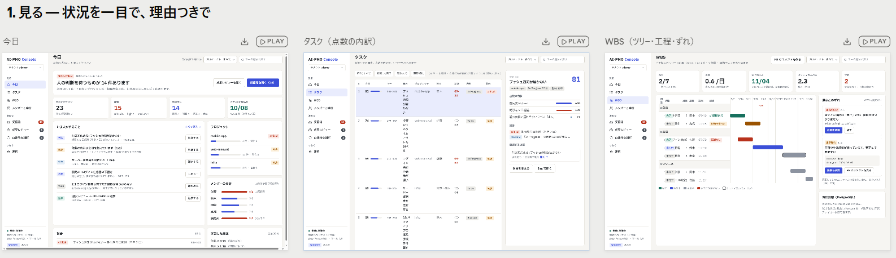
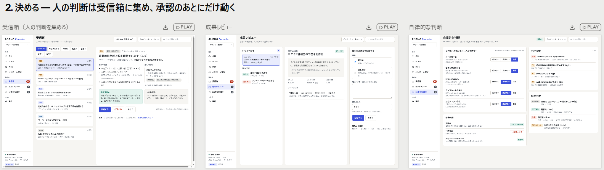
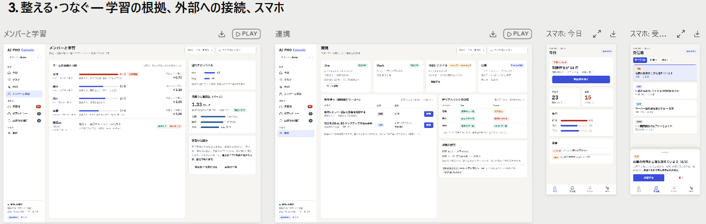
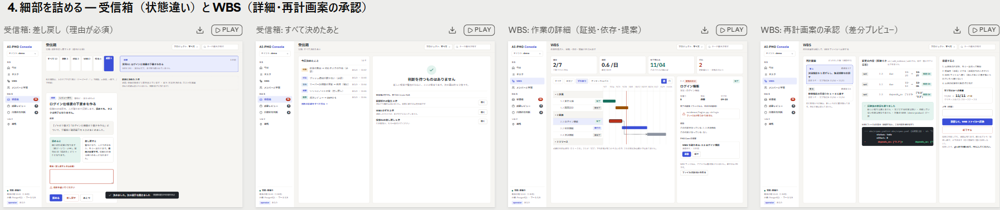
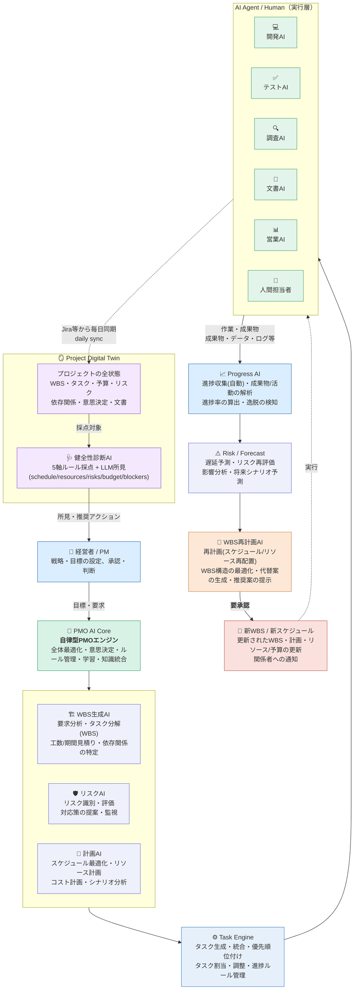

# AI-PMO Platform

[](https://github.com/itanaka66/AI-PMO-Platform/actions/workflows/tests.yml)









[ランディングページ](https://itanaka66.github.io/AI-PMO-Platform/) — 概要を3分で。
/ [Landing page](https://itanaka66.github.io/AI-PMO-Platform/) — the 3-minute overview.

はじめての方は [はじめてのガイド（8言語）](docs/guide/README.md) をどうぞ。
New here? Start with the [getting-started guide (8 languages)](docs/guide/README.md) .

CLI だけで動きます。ブラウザ画面（PC・スマホどちらでも）で使いたい・
進捗を人に見せたいなら、[INSTALL.md](INSTALL.md) の「WebUI は要る？」を
先に確認してください。

It runs on the CLI alone. If you want a browser screen (PC or phone) or to
show progress to someone else, check "Do you need the WebUI?" in
[INSTALL.md](INSTALL.md) first.

<a href="https://claude.ai/code/artifact/877371e4-7535-46c8-91bb-027d61dbc1a6" target="_blank">初心者向けAI-PMO
はじめてのガイド</a>  PMO 業務のノウハウを「実行可能なテンプレート」として記述し、LLM と外部ツール連携を
組み合わせて自動実行する基盤。 

<a href="https://claude.ai/code/artifact/877371e4-7535-46c8-91bb-027d61dbc1a6" target="_blank">AI-PMO Getting Started Guide for beginers</a>  A runtime that encodes PMO know-how as executable templates and runs them by
combining LLM calls with the tools a team already uses.

**すべて無料です。** 機能制限版でも試用版でもありません。GPL-3.0 License なので、
商用利用も再配布も自由です（コピーレフト——再配布・改変版も GPL-3.0 で
公開し、ソースコードを添える必要があります）。

**All of it is free** — not a reduced edition, not a trial. GPL-3.0 licensed, so
commercial use, modification and redistribution are all permitted (copyleft —
a redistributed or modified copy must also be GPL-3.0 and include its source).

---

## アーキテクチャ（構想） / Architecture (vision)

PMO 業務全体を、経営者/PM の承認を挟みながら自律的に回すループとしての全体像。
図の各要素と、実際に動いているコードとの対応は図の下の表を参照。

The overall loop this project is working toward — an autonomous PMO cycle
with the executive/PM's approval as its gate. See the table under the
diagram for how each box maps to code that actually exists today.


```mermaid
flowchart TB
    exec["👤 経営者 / PM<br/>戦略・目標の設定、承認・判断"]
    core["🧠 PMO AI Core<br/><b>自律型PMOエンジン</b><br/>全体最適化・意思決定・ルール管理・学習・知識統合"]

    subgraph planning[" "]
        direction LR
        wbs_gen["🏗️ WBS生成AI<br/>要求分析・タスク分解(WBS)<br/>工数/期間見積り・依存関係の特定"]
        risk_ai["🛡️ リスクAI<br/>リスク識別・評価<br/>対応策の提案・監視"]
        plan_ai["📅 計画AI<br/>スケジュール最適化・リソース計画<br/>コスト計画・シナリオ分析"]
    end

    task_engine["⚙️ Task Engine<br/>タスク生成・統合・優先順位付け<br/>タスク割当・調整・進捗ルール管理"]

    subgraph execution["AI Agent / Human（実行層）"]
        direction LR
        dev["💻<br/>開発AI"]
        test["✅<br/>テストAI"]
        research["🔍<br/>調査AI"]
        doc["📄<br/>文書AI"]
        sales["📊<br/>営業AI"]
        human["🧑<br/>人間担当者"]
    end

    progress["📈 Progress AI<br/>進捗収集(自動)・成果物/活動の解析<br/>進捗率の算出・逸脱の検知"]
    forecast["⚠️ Risk / Forecast<br/>遅延予測・リスク再評価<br/>影響分析・将来シナリオ予測"]
    replan["🔄 WBS再計画AI<br/>再計画(スケジュール/リソース再配置)<br/>WBS構造の最適化・代替案の生成・推奨案の提示"]
    new_wbs["🌳 新WBS / 新スケジュール<br/>更新されたWBS・計画・リソース/予算の更新<br/>関係者への通知"]

    subgraph twin_group["🪞 Project Digital Twin"]
        direction LR
        twin["プロジェクトの全状態<br/>WBS・タスク・予算・リスク<br/>依存関係・意思決定・文書"]
        twin_diag["🩺 健全性診断AI<br/>5軸ルール採点 + LLM所見<br/>(schedule/resources/risks/budget/blockers)"]
        twin -->|採点対象| twin_diag
    end

    exec -->|目標・要求| core
    core --> planning
    planning --> task_engine
    task_engine --> execution
    execution -->|作業・成果物<br/>成果物・データ・ログ等| progress
    progress --> forecast
    forecast --> replan
    replan -->|<b>要承認</b>| new_wbs
    new_wbs -.->|実行| execution

    execution -.->|Jira等から毎日同期<br/>daily sync| twin
    twin_diag -->|所見・推奨アクション| exec

    classDef exec fill:#dbeeff,stroke:#2f6db5;
    classDef core fill:#d9f2e6,stroke:#2f9e6f;
    classDef plan fill:#eef1fb,stroke:#6b6fd6;
    classDef task fill:#e6f0fb,stroke:#3f7fc1;
    classDef ex fill:#e3f5ea,stroke:#3fa26b;
    classDef prog fill:#dbeeff,stroke:#2f6db5;
    classDef risk fill:#eef1fb,stroke:#6b6fd6;
    classDef plan2 fill:#fde8d8,stroke:#d4813a;
    classDef wbs fill:#fbe1de,stroke:#c1554a;
    classDef twin fill:#f3e8fd,stroke:#8a4fd6;
    class exec exec;
    class core core;
    class wbs_gen,risk_ai,plan_ai plan;
    class task_engine task;
    class dev,test,research,doc,sales,human ex;
    class progress prog;
    class forecast risk;
    class replan plan2;
    class new_wbs wbs;
    class twin,twin_diag twin;
```

| 図の要素 / Box | 対応する実装 / What actually exists |
|---|---|
| WBS生成AI | `wbs_from_meeting` テンプレート |
| リスクAI・Risk / Forecast | `risk_forecast` アダプタ（`forecast` / `classify_drift`、閾値ヒステリシス付き） |
| WBS再計画AI | `wbs_replan` / `wbs_replan_jira` / `wbs_file_replan` テンプレート（`agent` ステップ、`wbs_replan.propose` のみ書き込み可） |
| 承認（経営者/PM） | Web UI の Proposals 画面、`/api/wbs-proposals/{id}/approve`\|`reject`（operator ロールのみ） |
| 新WBS / 新スケジュール | `wbs_replan_proposals` テーブル（承認されるまでは提案のまま。生WBSへの自動反映はしない） |
| Progress AI | `sprint_health` / `agile.sprint_issues`（進捗率・完了ポイントはアダプタ側で計算、AIには集計させない） |
| Project Digital Twin | `digital_twin_sync` テンプレート（Jira から毎日同期）が書き込む12テーブル（[sql/schema.sql](sql/schema.sql)）。詳細は [docs/PROJECT-DIGITAL-TWIN.md](docs/PROJECT-DIGITAL-TWIN.md) |
| 健全性診断AI | `digital_twin_diagnose` テンプレート。`aipmo/health.py` の `assess_project_health` が5軸を決定論的に採点し、LLM は所見・推奨アクションの文章だけを書く（スコアの再計算はしない） |
| Task Engine | `aipmo/task_engine.py`。**進捗の自動収集と、タスクの生成も行う**（[docs/TASK-GENERATION.md](docs/TASK-GENERATION.md)）：`pmo_core.collect` に書いた課題管理ツールの検索を定期的に読み、さらに台帳の未完了タスクのうち走査に現れなかったものを ID で読み直すので、閉じられて検索から外れた課題の完了（と、そこから学習される実績）も観測できる（読み取り専用）。`pmo_core.generate` には、運用者が書いた**定期タスク**（期間ごとに一度）と、続く重大な警告から起こす**対応タスクの提案**（人の承認待ち。承認まで順位に入らず、却下も記録に残る）を書ける。生成したタスクは台帳だけで、課題管理ツールには作らない。実行が終わるたびに各テンプレートの出力（`items: [{key, summary, assignee, due_date, priority…}]`）からタスクを集め、Jira キー／タイトルで1件に統合し、優先度・期限超過・ブロック・複数テンプレートからの指摘で決定論的に採点して順位付けする（LLM は使わず、内訳は `--why` で見える）。`aipmo schedule` の常駐中は時間経過でも順位を更新。台帳は SQLite（WAL）の `task-ledger.db`：`aipmo schedule`・`aipmo serve`・`aipmo run` が別プロセスで同時に書いても、書き込みごとに「ロックを取る→最新を読み直す→差分だけ書く」ので更新が失われない（以前の `task-ledger.json` は初回起動で自動的に取り込み、`.json.migrated` に改名。同じファイルを複数マシンで共有するネットワークドライブ上での利用は不可）。**テナント・プロジェクトの分離**：台帳には持ち主のテナント（`tenant:`）が刻印され、別テナントの設定で開こうとすると（設定のコピーやボリュームの取り違え）データに触れる前に拒否される。台帳の隣のファイル（ブリーフィング・判断ログなど）は、既定名以外の台帳では台帳名が前に付くので、同じディレクトリに複数の台帳を置いても上書きし合わない。各タスクは所属プロジェクト（課題キーの接頭辞 → 出力の `project` → 実行パラメータ `jira_project` / `project` の順）を持ち、キーのないタスクの統合もプロジェクト内に限られる。`pmo_core.members[].projects` で担当してよいプロジェクトを限定でき、`aipmo tasks|pmo|assign --project X` と Web 画面の選択で絞り込める。`web.viewer_projects: [A, B]` を設定すると、閲覧用トークンはそのプロジェクトのタスク・警告・判断だけを見られる（メンバーの負荷・学習した補正・応答・ほかのプロジェクトは出ない）。1つのサーバーで複数テナントを同時に扱う仕組みはなく、テナントごとに設定とプロセスを分ける前提。**PostgreSQL にも置ける**（`task_engine.backend: postgres`、接続先は `task_engine.dsn` か `adapters.postgres.dsn`、`tenant` が必須）：複数ホスト・ネットワーク越しに同じ台帳を使えて、テナントは行で分かれる（1つの DB に複数テナントを同居できる）。書き込みはテナントごとの `pg_advisory_xact_lock` で直列化し、別テナントは互いを待たない。PostgreSQL の再起動後も接続を張り直して続ける。**デモ**：`aipmo --config demo/config.yaml demo load` で、3 プロジェクト・22 件のタスクと完了実績・WBS のずれを台帳（SQLite、`demo/config.postgres.yaml` なら PostgreSQL）に入れ、警告・提案・役割AIの成果レビュー・自律的な判断・起票を外部サービス無しで試せる（本物の判定で作る。`tenant: demo` でだけ動く。手順は [docs/DEMO.md](docs/DEMO.md)）。画面（`aipmo serve`）の台帳への接続は**プールで上限をつける**（`web.pool.size`、既定 8。多数が同時にアクセスしても接続は増えず、全部使用中なら待ってから 503。状況は `/api/health`。[docs/LEDGER-STORAGE.md](docs/LEDGER-STORAGE.md)）。SQLite → PostgreSQL は `aipmo ledger migrate`、**PostgreSQL → SQLite は `aipmo ledger migrate-to-sqlite`**（どちらも移行先に行があれば `--force` が要る。移行元は消さない。写したあと読み直して一致を確かめ、完了実績は二重にしない）、現状は `aipmo ledger info`。ブリーフィング・判断ログ・状態など台帳の**隣に置くものも、PostgreSQL では同じデータベースに入る**（`task_engine.side_storage: auto`。SQLite は従来どおり隣のファイル、`database` にすれば SQLite でも台帳の `.db` に入る）ので、`schedule` と `serve` を別ホストに分けても同じブリーフィング・判断ログが見える（[docs/LEDGER-STORAGE.md](docs/LEDGER-STORAGE.md)）。既存のファイルは `aipmo ledger migrate` / `ledger side-import` で取り込める。表示は `aipmo tasks`。タスクの割当・進捗ルール管理は下の PMO AI Core が担う。**自律的な判断**（診断→対処の選択→許された範囲での実行、遮断器・一時停止つき、LLM 不使用）は [docs/JUDGMENT.md](docs/JUDGMENT.md)。**WBS の更新漏れを PR に知らせる**：`aipmo wbs notify`（と `wbs-drift` ワークフロー）が、証拠が揃ったのに未完了・完了なのに証拠が消えた作業を、この PR が変えたファイルに関係するものを先にして、PR の 1 つのコメントとして知らせる（既定は表示だけ。PR を失敗にせず、fork では動かさない。[docs/SELF-WBS.md](docs/SELF-WBS.md)）。**WBS 変更提案の承認→ファイル反映**：`wbs_replan` の提案の `diff.changes`（決まった形の変更）を、人が承認したとき WBS ファイルへ反映する（`aipmo wbs proposals approve`・Web の承認。反映後の内容まで検証し、書式・コメントを保ち、競合・二重反映・別の WBS への反映を止める。[docs/SELF-WBS.md](docs/SELF-WBS.md)）。**実サービスとの接続の診断**：`aipmo integrations`（と画面の「連携」の「接続を確かめる」）が、疎通 → 1 件の読み取り → 担当候補の一覧を読み取りだけで確かめ、止まった所と原因（認証・見つからない・タイムアウト…）を返す（秘密は伏せる。[docs/LIVE-TRACKERS.md](docs/LIVE-TRACKERS.md)）。**Plane・OpenProject の担当者の引き当て**：`accounts` を書かなくても、トラッカーの担当候補の一覧から名前（や `email`）の**完全一致**でユーザー ID を引き当てて書き戻す（曖昧・該当なしは書かない。`aipmo members` で事前に確かめられる。[docs/TICKET-TRACKERS.md](docs/TICKET-TRACKERS.md)）。**役割AIの成果のレビュー**：役割AIの成果を人が認める／差し戻した記録を台帳の実行記録に残す（`aipmo agents review`・Web のボタン。差し戻しには理由が要り、警告になる。AI 自身はレビューできない。[docs/ROLES.md](docs/ROLES.md)）。**WBS の更新漏れ・証拠の欠け**：`pmo_core.generate.wbs` を書くと、WBS を読んで「終わっていそうなのに未完了」「完了なのに証拠が無い／消えた」を、承認待ちの対応タスクの提案にする（WBS は読むだけ。直れば未決の提案は取り下げ。[docs/TASK-GENERATION.md](docs/TASK-GENERATION.md)）。**承認したタスクの起票**：`pmo_core.filing` を書くと、承認した対応タスクと定期タスクを課題管理ツールにも課題として作れる（人が `aipmo file` か Web のボタンで決める。`auto` に書いた由来だけ常駐が起票。冪等で、起票後は同じ課題が別タスクとして増えず、課題側で閉じれば台帳でも完了。[docs/TASK-GENERATION.md](docs/TASK-GENERATION.md)） |
| PMO AI Core | `aipmo/pmo_core.py`。台帳の上で1周ごとに、①担当者のいないタスクへ**担当者を提案**（空き容量・スキル＝ラベル一致で選定。上限に達した人には積まず、空きが無ければ「割当先なし」と報告）、②**進捗ルール**を全タスクに適用（期限超過・停滞・長期ブロック・担当未定・期限間近で未着手。`pmo_core.rules` で閾値・重大度を上書き）、③新しく出た警告だけを Slack 通知（`pmo_core.notify.slack_channel`、再通知間隔つき）、④全体のブリーフィングを `pmo-briefing.json` に出力。判断は決定論的（LLM 不使用）で、すべて追記専用の `pmo-decisions.jsonl` に残る。担当の**確定は人**が `aipmo assign KEY --apply [--writeback]` で行い、その時初めて、そのタスクが載っているトラッカー（Jira・GitHub Projects・Plane・OpenProject・Azure DevOps）の担当者を更新する（`--jira` は旧名）。宛先は台帳のタスクが持つ（トラッカーの出力を拾った時点で、どのアダプタの出力かと識別子を記録する）。**名前は推測しない**：Jira 以外は、メンバーごとに `pmo_core.members[].accounts`（GitHub はログイン名、Azure DevOps は表示名かメール、Plane は ユーザー UUID、OpenProject は数値のユーザー ID）に書いたアカウントだけを使い、無ければ**何も書かずに止まる**。書いたあとに反映を確かめ、トラッカーが受け付けなかった場合（GitHub は存在しないログインを黙って捨てる）は成功にせず、台帳も変えない。表示は `aipmo pmo`、または Web 画面（`aipmo serve`）の「PMO Core」欄（警告・優先順位と点数の内訳・担当の提案・メンバー負荷・学習した補正・直近の判断。閲覧は viewer にも可、画面からできる書き込みは「担当の確定」だけで operator のみ。常駐側が書くファイルを読むだけで、画面から周や通知・テンプレート起動は行わない。常駐側の更新が止まると経過時間を警告）。⑤**学習**（`aipmo/pmo_learning.py`）：完了を観測するたびに、期限に対する遅れと、見積り（点）・着手から完了までの実日数を実績として台帳に残し、次の4つだけを調整する。①メンバーごとの実効キャパシティ（期限内完了率がチーム平均より高ければ増、低ければ減。0.5〜1.5倍）、②平均より遅れやすいラベルの順位加点（0〜15点）、③**優先度ごとの重みの補正**（その優先度が全体より遅れやすければ増、確実に間に合っていれば減。±10点まで）、④**見積り精度とペース**（1点あたりの日数。チーム・メンバーごとの中央値）：自分を除いて予測し直した誤差の中央値が閾値（既定75%）以内、つまり**見積りが当たっていると確かめられたときだけ**、「見積り×ペースでは期限に間に合わない」タスクを順位で上げ、理由を `--why` に出す（当たっていなければ使わず、画面にも「順位には使わない」と出る）。統計の補正で LLM は使わず、最低サンプル数（既定5件）・小標本の平均への縮小・上下限・中央値の歯止めつき。根拠は `pmo-learned.json` と `model_updated` の判断ログ。`pmo_core.learning` の `enabled` / `priority` / `estimates` / `max_estimate_error` で個別に調整・無効化できる。実日数は定期実行の間隔ぶん粗い（最短1日）。⑥**高リスク時のテンプレート自動起動**：`pmo_core.responses` に運用者が書いたテンプレートだけを、全体レベル（`min_level`）・ルール（`rules`）・警告件数（`min_alerts`）の条件、`cooldown_hours`、`max_per_day`、同一応答の重複起動禁止の範囲で、`aipmo schedule` の常駐中に別スレッドで起動する（トリガーに警告・優先順位を渡す。存在しないテンプレート名は起動時に設定エラー）。`aipmo pmo` は起動せず「起動するはずのもの」だけを表示 |
| 開発AI・テストAI・調査AI・文書AI・営業AI | `templates/roles/` の `role_developer` / `role_tester` / `role_researcher` / `role_writer` / `role_sales`。`agent` ステップに役割ごとの道具（最小限を列挙）と憲章・プロンプトを与えた構成。開発AI・テストAIが書けるのは Jira コメントだけ（1回ごとに人の承認）、調査・文書・営業AIは読み取り専用で、文書・営業AIの成果は社内レビュー用チャンネルへの**下書き**まで（顧客や公開先へ出す手段は持たせない）。詳細は [docs/ROLES.md](docs/ROLES.md)。**Task Engine とも接続済み**：`pmo_core.members` に `kind: agent` で書くと担当候補になり（ラベルがスキルに一致するタスクだけ・人が先）、人が確定した割当を PMO Core が役割のテンプレートに一度だけ任せ、成果の要約を台帳に残す。向かないタスク・失敗・時間切れは警告になって人に回る（`aipmo agents`）。コードを書く・テストを実行する等の実作業は行わない |

図が示す「PMO AI 自身の開発を WBS で管理する」という自己参照的な運用は、**動いている**。
このプロジェクト自身の開発を [wbs/aipmo.yaml](wbs/aipmo.yaml) に WBS として持ち（人が PR で書き換える）、
`aipmo wbs status` で進捗・速度（直近の完了実績から）・完了見込み・クリティカルパス・次に着手できる作業を
数える。**「完了」は証拠（ファイルと、その中の語句）が実在するときだけ**通り、CI（`aipmo wbs check`）が
確かめる — WBS が現実から静かに離れていくのを防ぐため。週次の `self_development` テンプレートが Slack に
報告し、同じ出力は Task Engine にも入って、未完了の作業が他のタスクと同じ台帳で順位付け・担当提案される。
AI は WBS を読むだけで書き換えない。運用の手順と限界は [docs/SELF-WBS.md](docs/SELF-WBS.md)。
まだ無いのは、WBS の変更を AI が提案して人が承認する経路（既存の `wbs_replan` とこのファイルの接続）。

The self-referential idea in the diagram — the PMO AI managing its own development via a WBS — is
**running**. This project's own development lives in [wbs/aipmo.yaml](wbs/aipmo.yaml) (changed by people,
in PRs); `aipmo wbs status` counts progress, speed (from recent completions), a completion estimate, the
critical path and what can start next. **"Done" passes only when the evidence — files, and phrases inside
them — exists**, checked by CI (`aipmo wbs check`) so the WBS cannot quietly drift from reality. A weekly
`self_development` template reports to Slack and feeds the Task Engine, so open work is ranked and given
assignee proposals like any other task. The AI reads the WBS and never writes it. See
[docs/SELF-WBS.md](docs/SELF-WBS.md). Still missing: a path where the AI proposes WBS changes and a human
approves them (connecting the existing `wbs_replan` to this file).

---

## できること / What it does

| テンプレート / Template | 内容 / Description |
|---|---|
| `meeting_to_tasks` | 会議 → 議事録 → TODO → Jira 起票 → Slack 通知 / Meeting → minutes → TODOs → Jira issues → Slack notification |
| `meeting_task_update` | 会議の内容から既存課題を更新（確信度で選別） / Updates existing issues from meeting content, filtered by confidence |
| `overdue_chase` | 期限超過の担当者へ個別に催促 / Individually chases overdue owners |
| `overdue_triage` | 遅延状況をエージェントが調査して報告 / An agent investigates delays and reports back |
| `role_developer` `role_tester` `role_researcher` `role_writer` `role_sales` | 役割特化のエージェント（開発・テスト・調査・文書・営業）。[docs/ROLES.md](docs/ROLES.md) / Role-specialised agents |
| `portfolio_investigation` | 複数プロジェクトを独立したサブエージェントで並行調査 / Investigates several projects concurrently, one subagent per project |
| `sprint_health` | スプリントの状況確認（問題があるときだけ通知） / Sprint health check — notifies only when something is wrong |
| `wbs_from_meeting` | 会議の決定事項から WBS の草案 / Drafts a WBS from meeting decisions |
| `wbs_risk_forecast` | WBS の遅延予測とドリフト検出、承認待ち提案の記録 / Forecasts WBS drift and records an approval-pending replan proposal |
| `portfolio_risk_forecast` | 複数 WBS を横断して遅延リスクを決定論的に採点し、危険な WBS だけ週次で報告 / Scores delay risk deterministically across several WBS, reporting weekly only on the ones at risk |
| `wbs_replan` | WBS の遅延を踏まえ、AI が実際の再計画案（何をどう変えるか）を考え、承認待ちの提案として記録 / An agent drafts an actual replan diff from the forecast and records it as an approval-pending proposal |
| `wbs_replan_jira` | wbs_replan と同じだが、タスク一覧を実際の Jira スプリントから取得する / Same as wbs_replan, but pulls the task list from a real Jira sprint |
| `wbs_file_replan` | wbs_replan と同じ判定だが、タスク一覧を WBS ファイル（wbs_file）から読み、人が承認すると WBS ファイルへ反映できる決まった形の変更（`diff.changes`）を提案する / Same as wbs_replan, but reads the WBS file and proposes fixed-shape changes that approval applies to it |
| `wbs_replan_options` | wbs_replan と同じだが、AI に依存関係・クリティカルパスを踏まえた性質の異なる2つの代替案（A/B）を考えさせ、それぞれ独立した提案として記録する / Same as wbs_replan, but has the agent draft two genuinely different alternatives informed by dependency/critical-path analysis, recording each as its own proposal |
| `wbs_proposal_cleanup` | 承認待ちのまま放置された WBS 再計画提案を定期的に無効化する / Periodically invalidates WBS replan proposals left pending too long |
| `digital_twin_sync` | Jira から Project Digital Twin（プロジェクト・WBS・タスク）を毎日同期 / Daily-syncs the Project Digital Twin (project, WBS, tasks) from Jira |
| `digital_twin_diagnose` | 5軸を決定論的に採点し、AI が所見と推奨アクションを記述して記録 / Deterministically scores five dimensions, then has the AI write findings and recommendations |
| `model_comparison` | 同じプロンプトを複数の AI に同時投稿し、書きぶりを比較 / Sends the same prompt to several AI providers at once and compares the results |
| `parallel_notify` | 独立した通知を同時に送り、実行時間を縮める / Sends independent notifications concurrently to cut run time |
| `crawl_watch` | 外部サイトの1ページを取得し、見出し・リンク・メタデータを Slack へ通知 / Fetches an external page and posts its headline, links, and metadata to Slack |
| `generalize_knowledge` | 社内知見を匿名化・一般化し、レビュー待ちの候補として提出 / Anonymizes and generalizes internal knowledge, submitting it as a candidate awaiting review |
| `construction/site_meeting` | 工程会議 → 是正起票・安全指摘の即時通知 / Site meeting → corrective-action issues and immediate safety-flag notification |
| `marketing/campaign_check` | キャンペーン進行（承認待ちを分けて扱う） / Campaign progress check, separating items awaiting approval |
| `manufacturing/line_downtime_triage` | 生産ライン停止の仕分け（安全・資材待ち・内製を分けて扱う） / Triages production-line downtime — safety, material-wait, and in-house causes kept apart |
| `consulting/scope_change_triage` | 契約範囲外の疑いがある課題を変更契約の確認候補として分離（納期・クライアント待ちも分けて扱う） / Separates issues that look outside the contracted scope as change-order candidates — deliverable deadlines and client-wait kept apart too |
| `legal/matter_deadline_triage` | 法務案件の期限確認（緊急・相手方待ち・秘匿特権を分けて扱う） / Legal matter deadline check — urgent, counterparty-wait, and privileged items kept apart |
| `customer_success/account_health_triage` | 顧客アカウントの状況確認（解約リスク・顧客待ち・自社遅延を分けて扱う） / Customer account health check — churn risk, customer-wait, and internal delay kept apart |
| `financial_audit/finding_remediation_triage` | 監査指摘の是正状況確認（重要度に応じて宛先を分ける） / Audit-finding remediation check, routed by severity |
| `higher_education/curriculum_approval_triage` | カリキュラム審議の進行確認（段階ごとに宛先を動的に変える） / Curriculum approval progress check, routed dynamically by review stage |
| `nonprofit/grant_compliance_triage` | 助成金事業の進行確認（報告期限・使途制限を分けて扱う） / Grant program progress check — reporting deadlines and use-of-funds restrictions kept apart |
| `insurance/claim_sla_triage` | 保険請求の期限確認（州別規制期限・不正疑い・契約者待ちを分けて扱う） / Insurance claim SLA check — state regulatory deadlines, suspected fraud, and policyholder-wait kept apart |
| `government_contracting/clearance_deliverable_triage` | 政府調達案件の確認（クリアランス失効・納品期限を分けて扱う） / Government contract check — clearance expiration and delivery deadlines kept apart |

連携先 / Integrations: Teams · Jira · Jira Agile · GitHub Projects · Plane ·
OpenProject · Azure DevOps · Slack · PostgreSQL ·
ベクトルストア（Qdrant・pgvector・Chroma・Milvus・Weaviate から選択）
AI: OpenAI · Gemini · Groq · OpenRouter · Claude · Ollama · vLLM · LM Studio

---

## 動作要件 / Requirements

### ソフトウェア / Software

| 項目 / What | 要件 / Requirement |
|---|---|
| Python（ソースから実行する場合 / running from source） | 3.10 以上 / 3.10 or later |
| Mac・Linux スクリプト / Mac/Linux script | bash、Python 3.10+（無ければ `install.sh` が案内 / `install.sh` guides you through it if missing） |
| Windows インストーラ / Windows installer | 追加要件なし・管理者権限不要 / none — no admin rights needed |
| Docker 版 / Docker deployment | Docker Desktop または Docker Engine + **Docker Compose v2** |
| クラウド展開 / Cloud deployment | Ubuntu 22.04/24.04（`bootstrap.sh` が Docker を自動導入 / `bootstrap.sh` installs Docker for you） |

### ハードウェア / Hardware

| 構成 / Setup | ディスク / Disk | メモリ / RAM | 備考 / Notes |
|---|---|---|---|
| クラウド AI 利用（Windows/Mac/Linux）/ Using a cloud AI provider | 数百MB / a few hundred MB | 指定なし / no particular requirement | 推論はクラウド側 / inference runs elsewhere |
| **Docker 版（ローカル LLM = Ollama）** / **Docker (local LLM via Ollama)** | **約20GB空き / ~20GB free** | **16GB 以上推奨 / 16GB+ recommended** | GPU があれば実用速度、無くても動作 / a GPU makes it fast, works without one |

クラウド展開（GCP・Azure・AWS・VPS・Hetzner・Oracle）のインスタンス種別・
費用・Qdrant/Ollama を同居させられるかどうかは
[docs/DEPLOY-TARGETS.md](docs/DEPLOY-TARGETS.md) の早見表と各ガイドを
参照してください——1GB クラスの無料枠は PostgreSQL・Ollama を外部前提と
する設計だが、Qdrant だけは外部の Qdrant Cloud を使えば無料枠のままでも
足りる。

For cloud deployment (GCP, Azure, AWS, a VPS, Hetzner, Oracle) — instance
sizes, cost, and whether Qdrant/Ollama fit alongside everything else — see
the cheat sheet and individual guides in
[docs/DEPLOY-TARGETS.md](docs/DEPLOY-TARGETS.md). The 1GB-class free tiers
assume external PostgreSQL and Ollama; Qdrant alone still fits even there,
via an external Qdrant Cloud plan.

---

## Quick start

```bash
# インストーラ / installers
./scripts/install.sh          # macOS / Linux
scripts\install.bat           # Windows
./scripts/install-docker.sh   # Docker (local AI)

# WebUI（スマホ向け画面）も入れる場合 / to also install the WebUI:
./scripts/install.sh --web
scripts\install.bat -Web
./scripts/install-docker.sh --web

# 開発者向け / from source
pip install -e ".[dev]"
pip install -e ".[cloud,data,web]"   # 全部入り / everything

aipmo setup                          # 初回設定 / first-run setup
aipmo validate templates/examples/meeting_to_tasks.yaml
aipmo run templates/examples/overdue_triage.yaml
aipmo serve --host 0.0.0.0           # スマホ向け画面 / mobile interface
aipmo schedule                       # 定時実行 / the scheduler
aipmo tasks --why                    # 横断の優先順位 / cross-template task ranking
aipmo pmo                            # PMO Core のブリーフィング / PMO Core briefing
aipmo assign KEY --apply --writeback # 担当の提案を確定し、トラッカーにも書く / confirm and write back to the tracker
aipmo collect                        # 課題管理ツールの進捗を台帳へ(読み取り専用) / collect progress from trackers
aipmo generated                      # PMO Core が作ったタスク(提案・定期)/ tasks the PMO Core made
aipmo file [REF --apply|--all --apply|--skip]  # 承認したタスクを課題管理ツールにも起票 / file approved tasks into the tracker
aipmo judgment [pause|resume|reset]  # 自律的な判断の状況・一時停止・遮断器の解除 / autonomous judgment
aipmo agents                         # 役割AIの状況・結果 / role AIs: status and results
aipmo agents run KEY                 # 役割AIに、いま任せる / hand a task to its role AI now
aipmo agents review [KEY --accept|--reject --note 理由]  # 成果を人が確かめた記録 / record a human review of a result
aipmo wbs status                     # PMO AI 自身の開発 WBS の状況 / this project's own WBS
aipmo wbs check                      # 同じ WBS の検証（証拠の欠け・循環）/ validate it
aipmo doctor                         # 接続確認 / connection check
pytest                               # 1015 件
```

---

## テンプレート DSL / Template DSL

```yaml
name: meeting_minutes
industry: software
trigger: "event:teams:meeting_ended"

params:
  jira_project: PROJ

steps:
  - id: fetch_transcript
    adapter: teams
    action: get_transcript
    inputs:
      meeting_id: "{{ trigger.meeting_id }}"
    retry: { max_attempts: 3, backoff_seconds: 5 }

  - id: minutes
    llm: { profile: default, temperature: 0.1 }
    prompt: minutes_ja
    inputs:
      transcript: "{{ steps.fetch_transcript.output.text }}"
    output_format: json
    output_schema:
      required: [title, decisions, action_items]

  - id: register_jira
    adapter: jira
    action: create_issues
    when: "{{ steps.todos.output.items }}"
    inputs:
      project: "{{ params.jira_project }}"
      issues: "{{ steps.todos.output.items }}"
```

ステップ種別は `adapter` / `llm` / `agent` / `expression` のどれを書いたかで
自動判定される。`kind:` を明示することもできる。

The step kind is inferred from which of `adapter` / `llm` / `agent` /
`expression` is present.

参照できる名前空間 / Available namespaces:

| 名前空間 | 内容 |
|---|---|
| `params.*` | 実行時パラメータ / runtime parameters |
| `trigger.*` | 起動イベントのペイロード / trigger payload |
| `run.*` | `id` / `template` / `started_at` / `date` |
| `steps.<id>.output` | 先行ステップの出力 / output of a preceding step |

### 繰り返し / Iteration

値の並びに対して、同じ工程を1件ずつ実行する。担当者ごとに1通ずつ送る、
といった処理はこれが無いと書けない。

```yaml
- id: chase
  for_each: "{{ steps.compose.output.messages }}"
  as: message
  where: "{{ message.confidence }} >= {{ params.threshold }}"
  max_items: 30
  adapter: slack
  action: post_message
```

1件の失敗で全体を止めない。結果は `.count` / `.failed` / `.skipped` で受け取る。
`{{ loop.number }}`（1始まり・表示用）、`{{ loop.index }}`（0始まり）、
`{{ loop.total }}` が使える。

`when` はループの前に一度しか評価されないため、要素自身の値で絞るには `where`
を使う。

One failure does not stop the rest. `when` is evaluated once before the loop, so
filtering on an element's own values needs `where`.

### 並列実行 / Parallel steps

互いに依存しないステップを `parallel:` にまとめると、同時に実行される。
Jira への起票と Slack への通知のように、片方の結果をもう片方が待つ必要が
ない工程を並べるのに使う。

```yaml
- id: notify_everyone
  parallel:
    - id: notify_slack
      adapter: slack
      action: post_message
      inputs: { channel: "#project-updates", text: "..." }
    - id: notify_teams
      adapter: teams
      action: post_message
      inputs: { channel: "{{ params.teams_channel }}", text: "..." }
```

グループの中の工程どうしは、互いの出力を参照できない（ロード時に検証される）。
後続のステップからは `steps.notify_slack.output` のようにそのまま参照できる。
1件の失敗で全体を止めない。全滅したときだけこの工程自体が失敗になる。

Steps inside one group cannot reference each other's output (checked when the
template is loaded, not at run time). Later steps can reference any of them
directly, e.g. `steps.notify_slack.output`. One failure does not stop the
rest; the group itself only fails when every step inside it does.

### エージェント / Agents

決められた工程を流すのではなく、AI が道具を選んで自分で呼ぶ。
手順が事前に決まらない仕事に向く。

```yaml
- id: investigate
  agent:
    tools: [jira.find_overdue]   # 使ってよい道具を列挙する
    allow_writes: false          # 既定。外の世界は変えさせない
    max_iterations: 5
  prompt_inline: 遅延の状況を調べて報告してください
```

詳しくは [docs/AGENTS.md](docs/AGENTS.md)。

### 複数の提供元を同時に呼ぶ / Multiple providers at once

`profile` の代わりに `profiles` を並びで書くと、同じプロンプトを複数の
LLM に同時に投げて、結果を並べて比較できる。

```yaml
- id: draft_minutes
  llm:
    profiles: [ollama, gemini, openai]   # ローカル + クラウド2つを同時に
  prompt: minutes_ja
```

1つが落ちても他は止まらない。全滅したときだけステップが失敗になる。
詳しくは [docs/PROVIDERS.md](docs/PROVIDERS.md)。

Write `profiles` instead of `profile` and the same prompt is sent to several
LLMs at once, with every answer kept for comparison. One provider going down
does not stop the others; the step only fails when all of them do. See
[docs/PROVIDERS.md](docs/PROVIDERS.md).

---

## 設計上の判断 / Design decisions

### プロンプトを YAML から分離した

業界別テンプレートの差分は、ほぼプロンプトに集中する。構造を共通化しておけば、
プロンプトだけ差し替えて別業界向けを作れる。

What differs between industry templates is almost entirely the prompt.

### LLM は論理プロファイル名で指定する

テンプレートには `profile: default` としか書かない。実際の割り当ては config 側。
提供元を乗り換えてもテンプレートは変わらない。

A template only ever says `profile: default`; the mapping lives in config, so
switching providers changes no template.

### 数えれば決まる値を、モデルに数えさせない

完了率、残り日数、経過日数は、数えれば決まる。言語モデルに数えさせると
間違えるし、**間違えても正しそうに見える。** アダプタか組み込み変換
（`days_between` / `count`）で計算し、モデルには解釈だけさせる。
Slack に出す数値も集計結果をそのまま貼る。言い換えの過程で数字が変わっても、
読む側には見分けがつかない。

Countable facts are computed before the model sees them: a language model
miscounts, and does so plausibly. Figures posted to Slack come from the
aggregation, not from the model — if one changed while being rephrased, a reader
would have no way to tell.

### 式評価を意図的に制限した

テンプレートは第三者が書いて配布される想定（教材販売）なので、Jinja2 のような
汎用テンプレートエンジンを入れると配布テンプレートが攻撃面になる。
値の参照と単純な二項比較しか許していない。

Templates are authored by third parties and distributed. A general-purpose
template engine would turn every distributed template into an attack surface.

### SQL とコレクション名をテンプレートに書かせない

同じ理由。PostgreSQL は `queries.yaml` に定義された**クエリ名とパラメータのみ**、
ベクトルストアは論理スコープ `private` / `public` のみ。`tenant` は接続設定から入るので、
テンプレートが上書きできない。

Same reasoning: a template passes a query name and bound parameters, or a
logical scope — never raw SQL or a collection name. The tenant comes from
connection config and cannot be overridden.

### ベクトルストアは5種類のうちどれを選んでも同じ道具として渡せる

Qdrant・pgvector・Chroma・Milvus・Weaviate は、共通の基底クラス
`VectorStoreAdapter` が scope 解決・公開可能性スコア・公開拒否をまとめて
持ち、各アダプタは接続方法と実際の検索・書き込み呼び出しだけを持つ。
config に設定したバックエンドがちょうど1つなら、論理名 `vector_store` でも
同じインスタンスが登録される。LLM の `profile` と同じ考え方——新しく書く
テンプレートは `vector_store.search` を使えば、あとでバックエンドを乗り換えても
書き換えが要らない。詳しくは [docs/VECTOR_STORES.md](docs/VECTOR_STORES.md)。

Qdrant, pgvector, Chroma, Milvus, and Weaviate share a common base class,
`VectorStoreAdapter`, which owns scope resolution, publicability scoring, and
refusing public writes; each adapter contributes only its own connection and
the actual search/upsert calls. Configuring exactly one backend also
registers the same instance under the logical name `vector_store` — the same
idea as an LLM `profile`. A newly written template that uses
`vector_store.search` survives a later backend switch untouched. See
[docs/VECTOR_STORES.md](docs/VECTOR_STORES.md).

### 公開コレクションへの書き込みをアダプタが拒否する

ナレッジの公開は、人間承認を経た昇格フローだけが行える。テンプレートができるのは
`submit_candidate` で候補として提出するところまで。**自動公開の経路を、
そもそもテンプレートから作れない。**

Publication happens only through the reviewed promotion workflow. The automatic
path does not exist at the adapter level, so no template can construct it.

### 公開可能性スコアは並び順のためだけにある

`submit_candidate` は公開可能性スコアを自動で算出する。テンプレート側が
数値を用意する必要はない。ただし、これは**レビュー待ち一覧の並び順を
決める下書きの値**であって、承認・却下の判定ではない。判定は必ず人間が行う。

数えれば決まる範囲（利用許諾レベル・宣言された一般化の度合い・メール
アドレスや課題番号らしき文字列の有無）だけを見る。**言語モデルには頼らない**
— 公開してよいかは誤ると取り返しがつかない判断で、間違っても
もっともらしく見えるものに任せるべきではない。利用許諾レベル A
（二次利用不可）は、他の要素に関わらず無条件で 0 点にする。

`submit_candidate` computes a publicability score automatically; templates
need not supply one. But it is only **a draft value that orders the review
queue** — never an approve/reject verdict, which stays a human's call.

It looks only at what is countable or matchable — consent level, the declared
degree of generalization, whether an email address or issue-key-shaped string
appears. **No language model is involved**: whether something is safe to
publish cannot be undone if wrong, and that is not a call to hand to something
that is plausible even when mistaken. Consent level A (no secondary use)
forces a score of 0 unconditionally, regardless of anything else.

### 一般化はエージェント、公開はやはり人間

社内固有の知見を一般化して候補として提出するところまでは、
`templates/examples/generalize_knowledge.yaml` がそのままエージェントとして
動く。識別情報を落とし、構造を残すという書き換えは言語モデルの仕事に
向くので、ここは既存の `agent` の仕組みをそのまま使っている——新しい
エンジンの機能は要らなかった。

変わらないもの: エージェントに渡す道具は `vector_store.submit_candidate` だけで、
`allow_writes: true` を明示しないと呼べない。利用許諾レベルは
`postgres.consent_level` から取った値をそのままプロンプトへ渡し、
**AI 自身には判断させない。** 提出は「レビュー待ちに載せる」ところまでで、
公開そのものは相変わらずここでは起こらない。（`vector_store` は設定した
ベクトルストアの論理名。Qdrant を選んでも pgvector を選んでも、このテンプレートは変わらない。）

Generalizing an internal insight and submitting it as a candidate is now a
working agent, `templates/examples/generalize_knowledge.yaml`. Stripping
identifying detail while keeping the structure is exactly the kind of
rewriting a language model is suited for, so this reuses the existing `agent`
mechanism as-is — no new engine capability was needed.

What stays the same: the only tool handed to the agent is
`vector_store.submit_candidate`, and it cannot be called without an explicit
`allow_writes: true`. The consent level is fetched from
`postgres.consent_level` and passed into the prompt as a given fact — **not
something the model decides for itself.** Submitting only ever means landing
in the review queue; publication still does not happen here. (`vector_store`
is the logical name for whichever backend is configured — this template is
unchanged whether that is Qdrant or pgvector.)

### 書き込みは読み取りより厳しく扱う

エージェントに `tools: [jira]` を渡しても課題は作られない。外の世界を変える操作には
`allow_writes: true` が別途要る。読み違いはやり直せるが、**書いた誤りはやり直せない。**

さらに更新は作成より危ない。作成の誤りは余計な課題が1件増えるだけだが、
更新の誤りは**すでに正しかった値を消す。**

Naming an adapter does not grant its write actions. A mistaken read can be
retried; a mistaken write cannot. And updating is worse than creating: a
mistaken create adds noise, a mistaken update destroys a value that was right.

### 承認する側が居なければ、書き込みは通らない

`allow_writes: true` は工程全体としての一括許可でしかない。1回ごとに
人へ判断させたい書き込みには `require_approval: true` を重ねる。
承認する関数（`run_agent` の `approve` 引数）を渡すかどうかは実行環境が
決め、テンプレートには一切見えない。

**渡さなければ、その書き込みは常に断られる。** 対話端末の無いスケジューラや
Web サーバーからの実行がこれに当たる。黙って許可される経路は無い —
承認を求める仕組みを立てておきながら、承認する相手が居ないときに
素通りさせては、立てた意味が無い。

`allow_writes: true` is only ever a one-time, blanket permission for a whole
step. `require_approval: true` layers a per-call human judgement on top of
it. Whether an approver function (`run_agent`'s `approve` argument) is
supplied is a runtime decision, invisible to the template.

**With none supplied, the write is always refused** — which is exactly what
happens when a scheduler or web server, having no interactive terminal, runs
the step. There is no path where it passes through unattended: a gate with no
one to approve through it would defeat the point of having one.

`config.yaml` の `approval.slack` を設定すれば、対話端末の代わりに
Slack が承認の場になる — スケジューラや Web からの実行でも、この
ゲートを実際に使えるようになる。Slack の Events API は使わず、
ボットトークンだけで動くポーリングにしている。詳しくは
[docs/AGENTS.md](docs/AGENTS.md)。

Setting `approval.slack` in `config.yaml` makes Slack the approval venue
instead of a terminal — so the gate becomes usable from a scheduled or
web-triggered run too, not just `aipmo run`. It polls rather than using
Slack's Events API, so it needs nothing beyond the bot token already in use
elsewhere. See [docs/AGENTS.md](docs/AGENTS.md).

### 冪等キーはトリガー由来

`run_id` ではなく `meeting_id` を起点にする。同じ会議を再処理しても Jira の
課題や Qdrant の point が重複しない。Jira には冪等の仕組みが無いので、
キーをラベルとして残し、作る前に検索する。

Keyed on `meeting_id` rather than `run_id`. Jira has no idempotency mechanism,
so the key is carried as a label and searched for before creating.

### 逃した実行は流さない

毎朝9時の報告を、正午に5日分まとめて送っても意味がない。それは通知の洪水で
あって報告ではない。逃したことは記録し、次の予定から再開する。

同じ理由で、**問題が無ければ何も送らない。** 毎朝「順調です」が届く
チャンネルは、そのうち読まれなくなる。読まれなくなった通知は、危ないときにも
読まれない。

Five days of a 9am report delivered at noon is a flood, not a report. For the
same reason, silence is the output when nothing is wrong: a channel that says
"all fine" every morning is not read when it matters either.

### 実行履歴はテンプレートを経由せず記録する

`postgres` アダプタを設定するだけで、実行の開始・各ステップ・終了が
自動で `runs` / `step_results` に記録される。テンプレートは何も書かない
— これはエンジン側の配線であって、DSL の機能にしない。書ける場所を
テンプレートに与えると、書く・書かないがテンプレートごとにばらつく。

履歴の書き込みが失敗しても、本来の業務処理は止めない。通知が届かない方が、
履歴が1件欠けるより困る。ステップ出力が大きい場合は丸ごと保存せず要約に
落とす — 無料枠クラスの小さな DB を議事録の全文だけで埋めないため
（詳しくは [docs/DEPLOY-ORACLE.md](docs/DEPLOY-ORACLE.md)）。並列グループの
中の工程も、それぞれ個別に記録される。

Configuring a `postgres` adapter is enough: a run's start, every step, and its
finish are recorded into `runs` / `step_results` automatically. Templates
write nothing for this — it stays engine-side wiring, not a DSL feature, so
whether history gets recorded never varies template to template.

A failed history write never aborts the actual workflow — a missing
notification is worse than a gap in the history. An oversized step output is
summarized rather than stored whole, so a free-tier database is not filled by
full meeting minutes alone (see
[docs/DEPLOY-ORACLE.md](docs/DEPLOY-ORACLE.md)). Steps inside a parallel group
are each recorded individually.

---

## テスト / Tests

1015 件。境界の保証と、黙って壊れる形を潰すことが主眼。

1015 tests, aimed at the guarantees and at the failure shapes that look like
success:

- テンプレートから生 SQL を渡せない / raw SQL cannot be passed from a template
- テンプレートが `tenant` やコレクション名を上書きできない
- 公開コレクションへの直接書き込みが拒否される
- 閲覧用トークンでは実行できない（画面ではなくサーバーが拒否する）
- Slack の `200 + ok:false` を成功として扱わない
- エージェントが許可外の道具を呼べない、上限で必ず止まる
- 前方参照・ID 重複・不正な cron はロード時に検出される
- 8言語のガイドとカタログに抜けが無い

push・PR のたびに GitHub Actions で自動実行される
（[.github/workflows/tests.yml](.github/workflows/tests.yml)）。同じ場所で
ruff によるリンティングと mypy による型チェックも行う（設定は
`pyproject.toml` の `[tool.ruff]` / `[tool.mypy]`）。
依存ライブラリの更新は Dependabot が週次で提案する
（[.github/dependabot.yml](.github/dependabot.yml)）。
コード自体の脆弱性は CodeQL が push・PR・週次で静的解析する
（[.github/workflows/codeql.yml](.github/workflows/codeql.yml)）。

Run automatically by GitHub Actions on every push and PR
([.github/workflows/tests.yml](.github/workflows/tests.yml)), which also
lints with ruff and type-checks with mypy (configured under `[tool.ruff]` /
`[tool.mypy]` in `pyproject.toml`). Dependency
updates are proposed weekly by Dependabot
([.github/dependabot.yml](.github/dependabot.yml)). The code itself is
statically analyzed for vulnerabilities by CodeQL on push, PR, and weekly
([.github/workflows/codeql.yml](.github/workflows/codeql.yml)).

---

## ドキュメント / Documentation

| | |
|---|---|
| [docs/guide/](docs/guide/README.md) | 入門ガイド（8言語）/ getting started |
| [INSTALL.md](INSTALL.md) | インストール / installation |
| [docs/MOBILE.md](docs/MOBILE.md) | スマホから使う・権限分離 / phone access and roles |
| [docs/PROVIDERS.md](docs/PROVIDERS.md) | AI の提供元 / AI providers |
| [docs/AGENTS.md](docs/AGENTS.md) | エージェント / agents |
| [docs/VECTOR_STORES.md](docs/VECTOR_STORES.md) | ベクトルストアの選択肢 / vector store choices |
| [docs/SCHEDULER.md](docs/SCHEDULER.md) | 定時実行 / scheduling |
| [docs/TEAMS.md](docs/TEAMS.md) | Teams 連携 / Teams |
| [docs/JIRA-SLACK.md](docs/JIRA-SLACK.md) | Jira と Slack |
| [docs/JIRA-WBS.md](docs/JIRA-WBS.md) | **Jira と WBS の設定・運用ガイド**（つなぎ方・日次/週次の運用・併用のしかた） |
| [docs/TICKET-TRACKERS.md](docs/TICKET-TRACKERS.md) | GitHub Projects・Plane・OpenProject・Azure DevOps |
| [docs/LIVE-TRACKERS.md](docs/LIVE-TRACKERS.md) | 実サービス（Jira・Plane・OpenProject）につなぐ確認 / verifying against real trackers |
| [docs/UI-PLAN.md](docs/UI-PLAN.md) | 専用 Web UI の実装計画と受信箱（`/api/inbox`）/ web UI plan and the inbox |
| [docs/CRAWLER.md](docs/CRAWLER.md) | Web クローラアダプタ / web crawler adapter |
| [docs/AGILE.md](docs/AGILE.md) | スプリント / sprints |
| [docs/PARALLEL-STEPS-DESIGN.md](docs/PARALLEL-STEPS-DESIGN.md) | 依存関係ベースの並列実行 — 設計中、Engine への配線は未着手 / dependency-based parallel execution — design doc; not yet wired into the Engine |
| [docs/PROJECT-DIGITAL-TWIN.md](docs/PROJECT-DIGITAL-TWIN.md) | プロジェクトの全状態管理とハイブリッド健康診断 / full project state and hybrid health diagnosis |
| [docs/INDUSTRIES.md](docs/INDUSTRIES.md) | 業界別テンプレート / industry templates |
| [docs/DEPLOY-ORACLE.md](docs/DEPLOY-ORACLE.md) | 無料クラウド構成（Oracle）/ free-tier deployment |
| [docs/DEPLOY-GCP.md](docs/DEPLOY-GCP.md) | 無料クラウド構成（Google Cloud）/ free-tier deployment |
| [docs/DEPLOY-AZURE.md](docs/DEPLOY-AZURE.md) | 無料クラウド構成（Azure）/ free-tier deployment |
| [docs/DEPLOY-AWS.md](docs/DEPLOY-AWS.md) | 無料クラウド構成（AWS EC2）/ free-tier deployment |
| [docs/DEPLOY-VPS.md](docs/DEPLOY-VPS.md) | 有料 VPS 構成（さくらの VPS 等）/ paid VPS deployment |
| [SECURITY.md](SECURITY.md) | 脆弱性の報告 / reporting a vulnerability |
| [docs/DEPLOY-HETZNER.md](docs/DEPLOY-HETZNER.md) | 有料 VPS 構成（Hetzner）/ paid VPS deployment |
| [docs/DEPLOY-TARGETS.md](docs/DEPLOY-TARGETS.md) | PostgreSQL・Ollama・Qdrant を内部/外部どちらにするかの手順 / step-by-step for internal vs external PostgreSQL, Ollama, and Qdrant |
| [NOTICE.md](NOTICE.md) | ライセンスと依存ライブラリ / licensing and dependencies |

---

## 未着手 / Not yet built

- **会議議事進行（リアルタイム）** — 別プロダクトラインの有料版として計画済み。
  ここでの「すべて無料」という原則とは別枠であり、この OSS リポジトリには
  今後も追加されない。

- **Real-time meeting facilitation** — planned as a paid offering under a
  separate product line, deliberately outside this repository's "all of it
  is free" principle. It will not be added here.

---

## ライセンス / License

GNU General Public License v3.0 (GPL-3.0-or-later) —
Copyright (C) 2026 株式会社エージーネディア / agNedia Inc.

**このリポジトリにあるものは、すべて無料です。** テンプレートもプロンプトも
同じ条件で、使うために支払うものはありません。

**Everything in this repository is free**, templates and prompts included.

詳細は [LICENSE](LICENSE)、依存ライブラリの扱いは [NOTICE.md](NOTICE.md) を
参照してください。 See [LICENSE](LICENSE) and [NOTICE.md](NOTICE.md).
